# agencedevoyage

🌍 Vacancia – Mobile Travel Booking Application
Vacancia is an Android application developed with Flutter and Firebase, designed to simplify the booking of flights, hotels, cars, and organised trips, within a smooth, secure, and multilingual interface (French, English, Arabic).

🧾 Key Features:

Complete booking process with history and cancellation options.

Add accommodations to favourites.

Integrated payment (CIB, Visa, MasterCard) with a secure form.

Sign in via email or Google.

Built-in help chatbot.

Currency selection based on country.

Secure personal space to edit user information.

⚙️ Technologies Used:
Flutter, Firebase (Auth, Firestore, Cloud Messaging)
Android Studio, VS Code
## 📸 Application Screenshots

### Authentification

  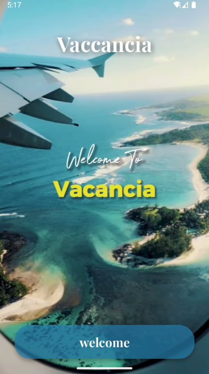
  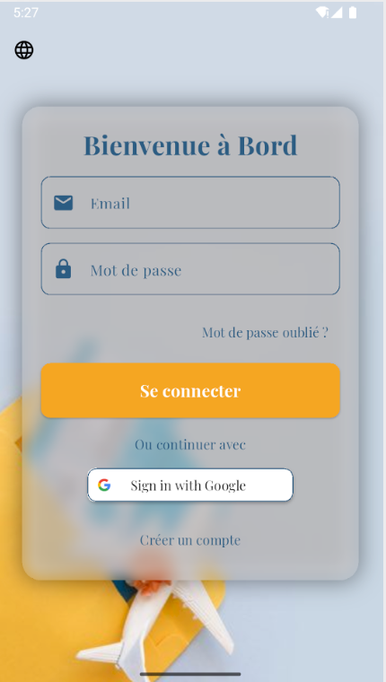
  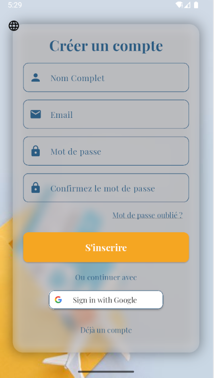

### Réservation

  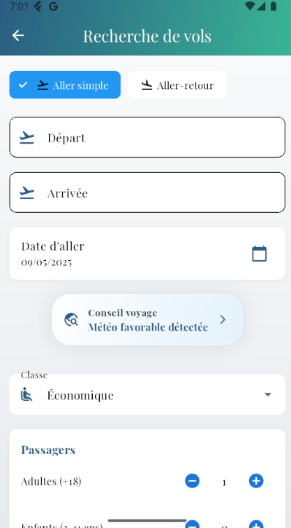
  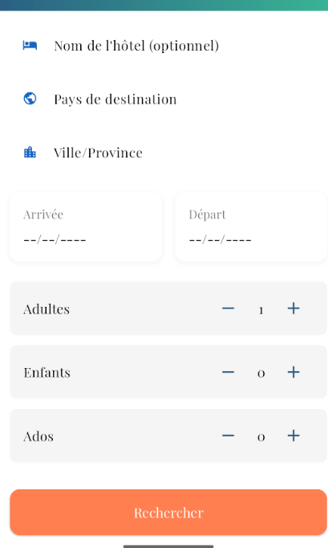
  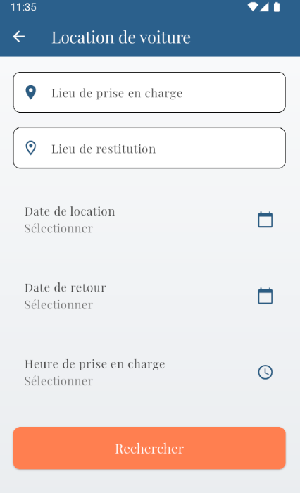

### Résultats & Paiement

  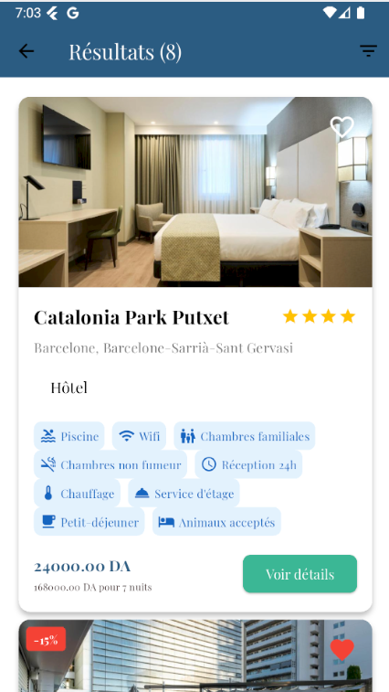
  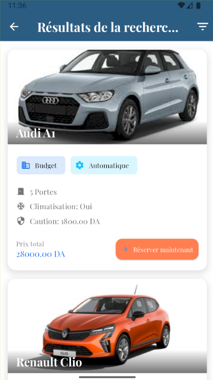
  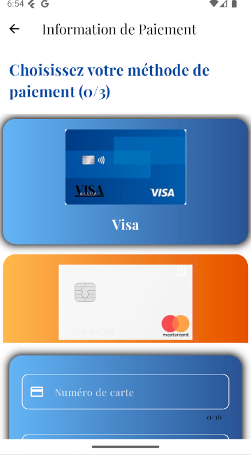

### Autres fonctionnalités

  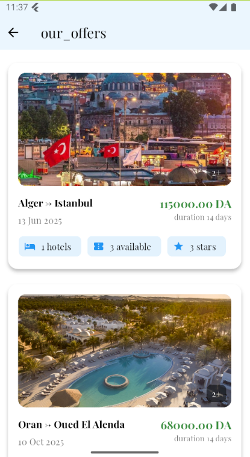
  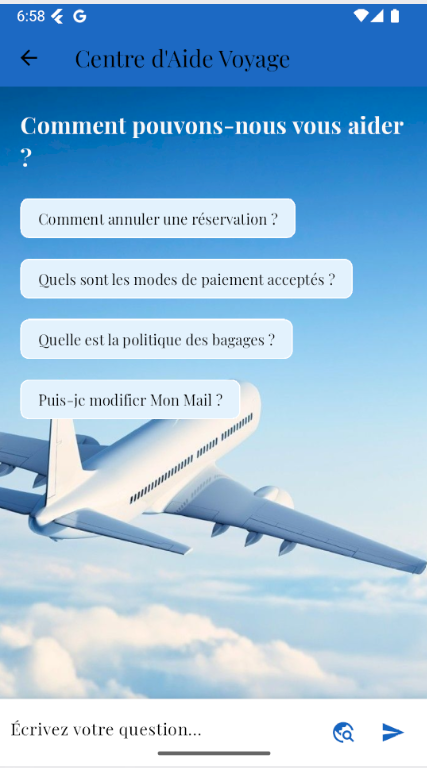
  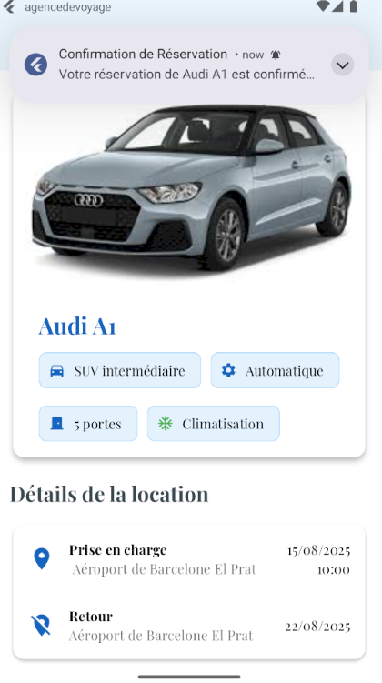

## Getting Started

This project is a starting point for a Flutter application.

A few resources to get you started if this is your first Flutter project:

- [Lab: Write your first Flutter app](https://docs.flutter.dev/get-started/codelab)
- [Cookbook: Useful Flutter samples](https://docs.flutter.dev/cookbook)

For help getting started with Flutter development, view the
[online documentation](https://docs.flutter.dev/), which offers tutorials,
samples, guidance on mobile development, and a full API reference.
"# Vanacia Travel Agency - Demo App" 
